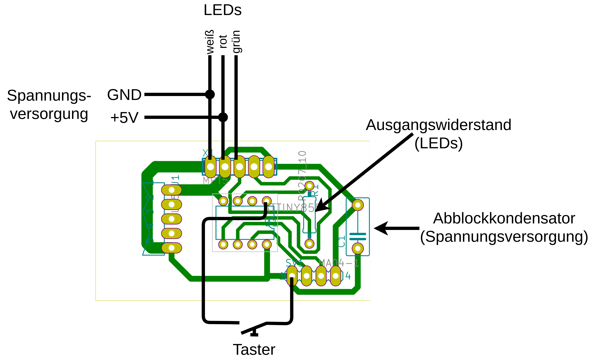
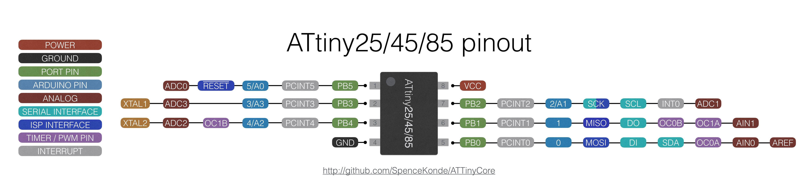

# Drumstorm LED

This project contains the Software and Hardware for the LED Controllers of Drumstorm.

## Hardware
Das [KiCAD](https://www.kicad.org/)-Projekt für die Hardware befindet sich im Hardware Ordner.

## Software
Das [Arduino](https://www.arduino.cc/)-Projekt für die Software befindet sich im Software Ordner.

### Programmierung
Für die Programmierung der Attiny85

kann ein Arduino Board (z.B. Arduino Uno, Arduino Mega) verwendet werden.
Eine Anleitung dafür, wie man dies macht ist unter https://www.instructables.com/Program-an-ATtiny-with-Arduino/ zu finden.
